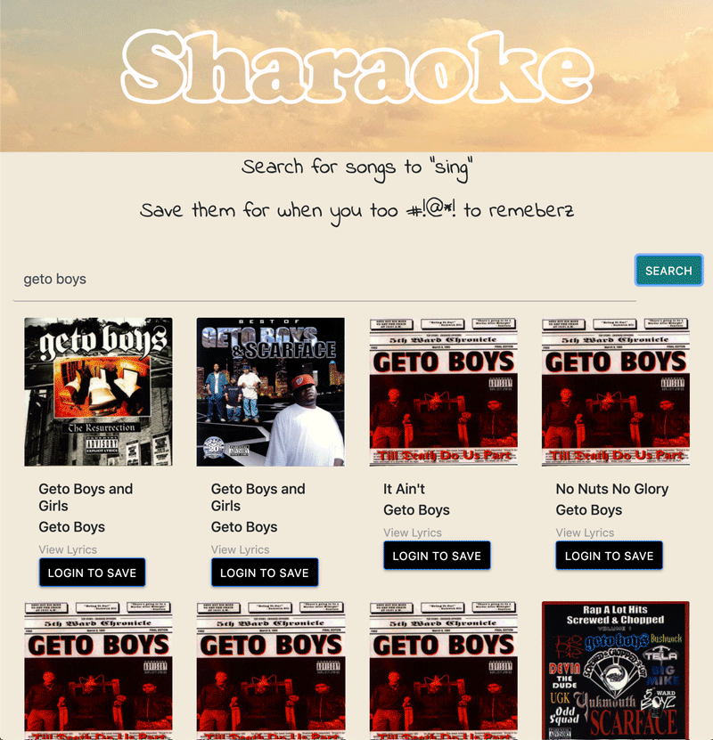

# Sharaoke 

**SHARAOKE** is an app that allows users to search for songs and share them with fellow users by saving them to a list. 

## Features

### Core

1. Use Firebase API to authenticate users
1. Authenticated users can 
   1. Search for songs using the Happi API
   1. Save songs to a shared playlist

### Known issues

1. Authenticated and unauthenticated users see same nav bar
1. Logo SVG animation works for desktop and tablet, not yet adapted to mobile

### Future features

1. Authenticated users can reorder playlist
1. Songs link to lyrics or clicking on songs displays lyrics within app

## Checklist

### Technical requirements

    

- [x] Use at least one JavaScript library that is not jQuery: 
   * [Firebase](https://github.com/firebase/) 
- [x] Use a CSS framework
   * [Bootstrap](https://github.com/twbs): search results are displayed in responsive rows of cards. 
- [x] Access at least two remote APIs using AJAX
   * **[Firebase](https://github.com/firebase/)**: Sharaoke uses Firebase for both authentication and data storage
   * **[Happi](https://happi.dev)**: Sharaoke uses Happi to search both songs and lyrics
- [x] README.md file written using Markdown
- [x] Your repo must be connected to Travis CI
- [x] Deployment of your application to somewhere reachable via a public URL.
   * Deployed to Firebase [here](https://user-auth-24fe0.web.app/)

#### Code organization and quality

- [x] Using StandardJS
- [x] Breaking code into modules
   1. App.js
   1. Functions.js
   1. Modals.js
   1. Userlist.js
- [x] Using build system
   * This repo contains a simple build + [Travis CI] setup.
   * It uses [npm scripts] (located in the `package.json` file under the `"scripts"` key) with
some basic tools like, [StandardJS]

### Workflow requirements

- [x] Tracking features/issues/tasks with [Github Project Pages](https://github.com/m-spilman/RollerSkate/projects/1)
- [x] Associate project tasks with [Issues](https://github.com/m-spilman/RollerSkate/issues)
- [x] Associate [PRs with Issues](https://github.com/m-spilman/RollerSkate/pulls?q=is%3Apr+is%3Aclosed)
- [x] 1+ team member reviews PR before committing to master
- [x] No self-review
- [x] Use PR criteria

## Process

### Research

 

### Building

 

### Testing

 

### Deployment

 

## Team

Matt Spilman

Oshea Deans

BJ Strew

## License

[ISC License](LICENSE.md)

[npm scripts]:https://scotch.io/tutorials/using-npm-as-a-build-tool
[Travis CI]:https://travis-ci.org/
[StandardJS]:https://standardjs.com/
